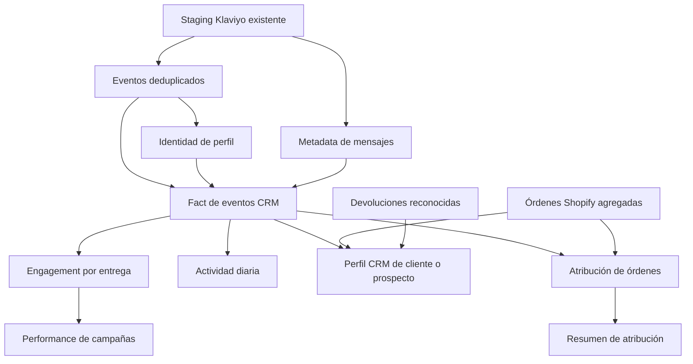

# CRM de Klaviyo en dbt

Esta implementación conserva **sin cambios** `stg_klaviyo__events` y el staging de campañas existente. Agrega vistas de dbt sobre las observaciones publicadas. No agrega ingesta, no publica perfiles a Klaviyo y no incorpora todavía vistas de Cube.

## Qué entrega

| Vista dbt | Para qué sirve |
| --- | --- |
| `fct_crm_event` | Un evento Klaviyo por tienda, deduplicado entre extracciones, con persona y mensaje. |
| `fct_crm_message_engagement` | Una entrega de email con sus aperturas y clics asociados. |
| `metric_crm_campaign_performance` | Entregas, aperturas, clics y tasas por día de entrega, campaña, flow y mensaje. |
| `metric_crm_activity_daily` | Eventos por día en que ocurrieron, incluidos los que no pudieron vincularse a una entrega. |
| `dim_customer_crm` | Perfil actual de interacción CRM, incluidos prospectos, unido a compras por email normalizado dentro de la tienda. |
| `metric_crm_customer_engagement` | Resumen de clientes, prospectos y perfiles sin identidad resuelta, separado por moneda. |
| `fct_crm_order_attribution` | Una fila por orden y regla: entrega a seis horas o clic a seis horas, también para órdenes sin atribución. |
| `metric_crm_attribution_daily` | Órdenes e importe atribuido por fecha de compra, regla, campaña y moneda. |

Todos se materializan como **views en analytics**. Los cuatro intermediates también son views y usan `tag:intermediate_view`; los marts heredan `tag:business_marts`. Comparten `tag:crm` para selección. No se cambian schedules. Al desplegar el código, las selecciones existentes de Dagster pueden descubrir estos nodos.



## Reglas implementadas

### Eventos y mensajes

- Clave de negocio: tienda + tipo de identificador + ID de evento; fallback a UUID. Si ambos faltan se retiene la clave de observación y se marca `event_id_basis = observation`: en ese caso no se garantiza deduplicación entre extracciones.
- Gana la última observación publicada, con desempate determinista. Los tipos desconocidos permanecen visibles.
- Se asume una cuenta Klaviyo por `shop_key`, porque el source no expone otra clave de cuenta.
- Campañas y mensajes se deduplican antes del join. Una discrepancia entre campaña del evento y metadata queda en `campaign_mapping_conflict` y no se reemplaza silenciosamente el ID del evento.
- Un flow no necesita tener metadata de campaña para conservarse; se conserva su `flow_id`.
- No se incorporan nombres de cuenta, fechas de migración ni reglas de clasificación de la referencia de otra empresa.

### Identidad y customer

No se promueve email sin hash a marts. Se utiliza SHA256 del email normalizado, siempre dentro de tienda. Cuando un perfil tiene más de un email distinto en sus eventos deduplicados, se marca como ambiguo y no se atribuyen sus compras. Cuando varios perfiles tienen el mismo email inequívoco, comparten identidad CRM.

`dim_customer_crm` incluye todos los perfiles observados, también prospectos. Los perfiles sin email o ambiguos quedan como `Unresolved`; no se clasifican como prospectos por falta de match. La base no es un export completo de todos los perfiles de Klaviyo ni de todos los compradores Shopify.

Incluye contadores acumulados, última interacción, clics de 30/90 días, órdenes, primera/última compra, gasto, RMV reconocido y valor neto observado. No calcula RFM histórico ni LTV maduro de 90/365 días. Las bajas son eventos, **no el consentimiento actual**.

La unión con órdenes usa email de la orden normalizado, no coincidencia probabilística ni un cambio retroactivo al email actual del cliente. Esto favorece precisión a costa de dejar compras sin match cuando cambió el email.

### Campañas: entrega vs. interacción

`received-email` es la señal de **entrega**, no de intento de envío. Un clic del martes puede ser actividad del martes y, a la vez, engagement de una entrega del lunes.

El source no expone un identificador de instancia de entrega. La asociación implementada es una **heurística explícita**: mismo perfil y mensaje en la misma tienda, desde la última entrega previa hasta antes de la siguiente. Si faltan perfil o mensaje, no se asignan interacciones; la entrega se marca como no vinculable. Empates de entregas al mismo timestamp se resuelven determinísticamente. Interacciones huérfanas siguen visibles en actividad diaria.

- `delivered_messages`: número de entregas observadas.
- `opened_messages` / `clicked_messages`: entregas con al menos una interacción; no personas únicas entre mensajes.
- `open_events` / `click_events`: interacciones totales.
- `open_rate = opened_messages / delivered_messages`.
- `click_through_rate = clicked_messages / delivered_messages`.
- `click_to_open_rate = clicked_messages / opened_messages`.

Las tasas son NULL si alguna entrega de la celda carece de claves para vincular interacciones. Para agrupar varias filas, recalcular la tasa desde sumas de componentes y exigir cero `unlinked_messages`; nunca promediar tasas. No imponer CTOR <= 1: un clic puede existir sin apertura registrada.

No se inventan flags de bots: `machine_open` y `bot_click` son NULL porque nuestro source no los expone. Estos son resultados observados, no métricas certificadas de interacciones humanas. No hay tasa de rebote sin un universo verificado de intentos; se cuentan eventos de rebote en actividad/customer.

### Atribución

Las reglas son alternativas y **no se suman entre sí**:

- `delivery_6h`: última entrega entre 180 y 21.600 segundos antes de la orden.
- `click_6h`: último clic entre 0 y 21.600 segundos antes de la orden.

Los límites son inclusivos. Cada orden no cancelada con fecha de procesamiento y líneas aparece una vez bajo cada regla, aun si no tiene contacto elegible. El evento ganador se decide por timestamp y clave de evento. Un evento puede ganar para varias órdenes; se deduplican candidatos por orden/regla, nunca por evento después del join.

Se preservan fecha/hora de contacto y de compra. `metric_crm_attribution_daily` usa fecha de compra UTC. No dividir ese revenue por entregas de la misma fecha para llamarlo revenue por envío: los universos temporales no coinciden necesariamente.

El valor es el importe de líneas post-descuento y antes de devoluciones, siguiendo el alcance actual del mart de revenue: no se agrega exclusión de gift cards o exchanges. No hay FX ni equivalencia garantizada con la atribución nativa de Klaviyo. Órdenes con importe/moneda incompletos no aportan un valor parcial engañoso: el valor queda NULL, con contador `missing_value_orders` en el agregado. No mezclar monedas ni modelos de atribución.

El perfil customer suma RMV reconocido a gasto bajo una moneda única conocida; si hay mezcla o incompletitud, no publica un valor monetario acumulado como válido.

## Consultas de ejemplo en BigQuery

Los datasets usan el proyecto configurado en la conexión.

Performance de campañas, agregando correctamente:

```sql
select
    shop_key,
    campaign_id,
    flow_id,
    sum(delivered_messages) as delivered_messages,
    sum(clicked_messages) as clicked_messages,
    case when sum(unlinked_messages) = 0
         then safe_divide(sum(clicked_messages), sum(delivered_messages)) end as ctr
from analytics.metric_crm_campaign_performance
where delivery_date between '2025-01-01' and '2025-01-31'
group by shop_key, campaign_id, flow_id
```

Órdenes atribuidas desde clic, sin mezclar moneda:

```sql
select shop_key, currency_code, campaign_id, flow_id,
    sum(attributed_orders) as attributed_orders,
    case when sum(missing_value_orders) = 0
         then sum(attributed_value) end as attributed_value
from analytics.metric_crm_attribution_daily
where attribution_model = 'click_6h'
  and order_date between '2025-01-01' and '2025-01-31'
group by shop_key, currency_code, campaign_id, flow_id
```

Prospectos con interacción reciente:

```sql
select shop_key, crm_person_key, click_events_30d, last_email_click_ts
from analytics.dim_customer_crm
where customer_status = 'Prospect' and click_events_30d > 0
```

## Validación y operación

Se ejecutan los SQL reales con fixtures locales mediante Jinja + SQLGlot + DuckDB. Se adapta COUNTIF a COUNT(CASE) para preservar el cero de BigQuery cuando todos los inputs son NULL. Esto verifica lógica, no sustituye una ejecución del engine de BigQuery.

```bash
.venv-platform/bin/python -m pip install -r tests/requirements-sql.txt
.venv-platform/bin/python -m unittest tests.test_crm_models
.venv-platform/bin/dbt parse --project-dir dbt --profiles-dir dbt --no-partial-parse
```

Tests de dbt: claves únicas, cobertura de órdenes en ambas reglas, ventanas de atribución, contadores de campañas e identidades ambiguas. El source no cambió.

Son vistas sobre todo el historial publicado, así que un evento tardío se refleja sin perder una partición antigua. No se aplicó una ventana de siete días que pudiera dejar fuera un backfill. El costo de consultar toda la historia debe medirse antes de materializar en producción; una futura estrategia incremental debe usar fecha de publicación y actualizar entregas/órdenes afectadas.

No se ejecutó `dbt run/build` ni se consultó BigQuery. Los resultados dependen de tener pobladas las fuentes. Las vistas de Cube y el contrato de serving no se ampliaron en este cambio: esta entrega corresponde al modelado dbt solicitado.

## Lo que no se implementa todavía

- Atribución desde sesión web: requiere validar la correspondencia entre campañas GA4 y Klaviyo; no se sustituye por una búsqueda por nombre sin evidencia.
- Limpieza de bots o machine opens sin las propiedades en el source.
- Metadata completa de flows/perfiles, consentimiento actual y segmentos históricos.
- Targets, engagement value con pesos monetarios y reparto estimado de bajas.
- SMS a seis horas: sus eventos quedan en actividad general, pero las reglas y performance de entrega actuales son explícitamente de email.
