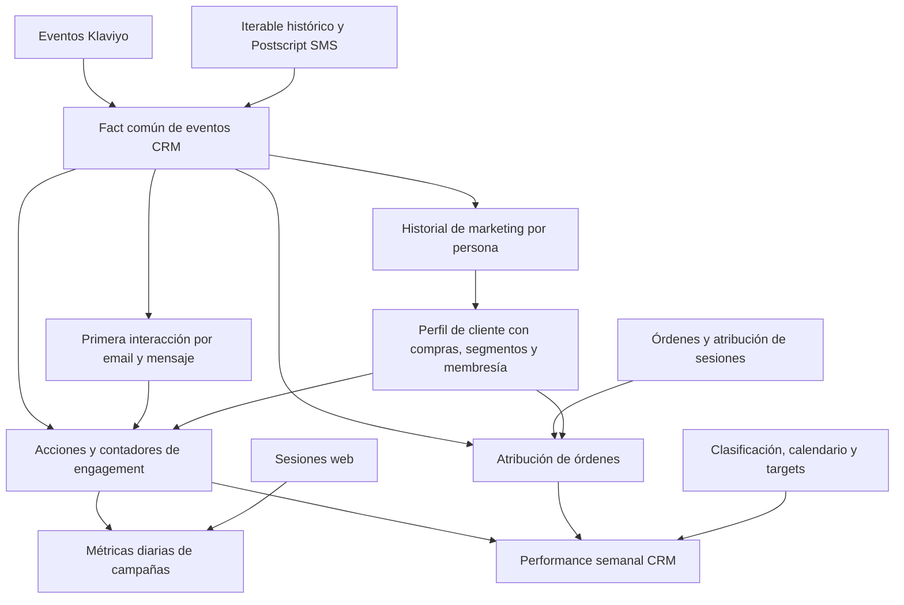
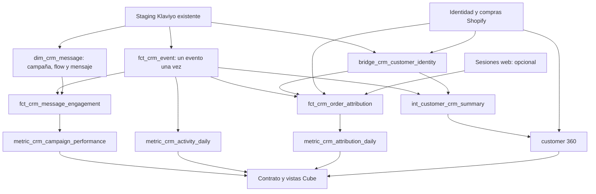

# Arquitectura propuesta de Klaviyo y customer

Estado: propuesta basada en los 12 archivos entregados y contrastada con el staging de commerce-brands-agent. No implementa ni despliega nuevos modelos. No se consultó el warehouse.

## Qué queremos obtener

Un mismo historial de eventos debe alimentar tres productos:

1. **Campañas:** cuántos mensajes se entregaron, abrieron o clickearon, y cómo rindió cada campaña o flow.
2. **Clientes:** qué comunicaciones recibió cada persona, cuándo interactuó y cómo se combina eso con sus compras, RFM y valor acumulado.
3. **Atribución:** qué órdenes e ingresos se asocian a una entrega, un clic o una sesión CRM, conservando cada regla por separado.

El documento adjunto describe una implementación productiva anterior. Sus cifras de volumen, costo, frescura y cobertura son reportes históricos de esa sesión, no mediciones verificadas aquí. Los SQL permiten reconstruir la lógica; varios contienen marcas de transcripción, dependencias ausentes y un archivo de atribución incompleto.

## La arquitectura que muestran los archivos

La conexión entre `xav_user_email` y los consumidores de `xa_user_email` es conceptual: el wrapper `xa_user_email` no fue entregado. No se verificó su linaje exacto.

## Lectura de todos los archivos

| Archivo entregado | Función observada | Qué conservar / cambiar |
| --- | --- | --- |
| `src_klaviyo_events.sql` | Une cuatro cuentas; mapea métricas a tipos de evento; conserva perfil, mensaje, flow y flags de automatización; deduplica por UUID. | Conservar la normalización. Usar cuenta explícita y clave de evento dentro de la cuenta, no inferir cuenta solo del metric ID. |
| `src_klaviyo_events_PARCIAL.sql` | Transcripción parcial de la misma fuente. | No es otro modelo. El ID de aperturas de Australia difiere respecto del archivo completo; no copiar IDs desde la transcripción. |
| `fct_marketing_email_klaviyo.sql` | Adaptador Klaviyo alternativo, con otro corte de migración y comparaciones de casing inconsistentes. | Ninguno de los otros SQL entregados lo referencia. No crear dos facts competidores; su condición de huérfano en el repo original completo proviene del análisis adjunto. |
| `fct_marketing_email.sql` | Fact común: Klaviyo email, Iterable histórico y Postscript SMS. Reprocesa siete días y permite backfills. | Conservar un fact normalizado y la estrategia de reproceso. No importar proveedores ni fechas de migración que no aplican al repo nuevo. |
| `xf_marketing_email_first_interaction.sql` | Primera ocurrencia de cada tipo de evento por email y mensaje. | Conservar la distinción total/único, pero incluir cuenta y resolver instancias de entrega para mensajes repetidos de flows. |
| `xf_user_email_marketing.sql` | Contadores acumulados de marketing por email; incluye email y SMS. | Es la pieza de customer engagement que faltaba en la propuesta anterior. Ampliar con primeras/últimas fechas y ventanas recientes. |
| `xav_user_email.sql` | Une identidad, adquisición, ventas, segmentos, membresía y marketing; deriva prospecto/cliente. | Conservar una vista final de customer 360. Necesita una base que incluya prospectos, no solo compradores. |
| `xa_marketing_email_action.sql` | Agrega acciones por hora, email, mensaje, campaña y atributos de cliente. Clasifica campañas y flows. | Separar clasificación de campañas, primeros eventos y agregados. No sumar conteos de personas como si fueran distintos a cualquier grano. |
| `xi_marketing_email_metrics.sql` | Junta engagement diario con sesiones y revenue web por campaña. | Conservar la lectura actividad→sesiones→compras, con claves canónicas. Su campo `orders` cuenta sesiones con órdenes, no cantidad de órdenes. |
| `xa_crm_email_attribution.sql` | Tres reglas: entrega 3–360 min, clic 0–360 min y órdenes atribuidas a sesión CRM con asignación de campaña. Comparativos semanales. | Descomponer en candidatos, ganadores por orden/regla y agregados. El SQL entregado termina antes de completar sus joins. |
| `xi_marketing_crm_performance.sql` | Consolida engagement, tres atribuciones, categorías L1/L2 y targets semanales. Distribuye bajas sin campaña por volumen de envíos. | Conservar el producto de reporting. Mantener observaciones, estimaciones y targets separados; no mezclar país de cuenta con país de compra. |
| `klaviyo_analisis.md` | Análisis previo de linaje, costos, bots, cobertura y duplicidad. | Usarlo como contexto y lista de hipótesis. No tomar sus consultas, frescura ni conteos como validaciones actuales. |

## Arquitectura para commerce-brands-agent

Reutilizar el staging de Klaviyo y los modelos de compras existentes. Agregar una capa de eventos común y tres ramas independientes. Los nombres siguientes son propuestos.

### A. Una base común: qué ocurrió

**`fct_crm_event` — una fila por cuenta y evento del proveedor.**

- Conserva tienda, cuenta, proveedor, canal, evento, perfil, mensaje, campaña/flow, hora UTC y fecha local configurada.
- Mantiene por separado `received`, `sent`, `open`, `click`, `bounce`, `subscribe`, `unsubscribe` y suppression. Recibir un email es la señal que la referencia llama send, no evidencia de un intento de envío independiente.
- Conserva flags de machine open y bot click, incluyendo su estado desconocido.
- Deduplica por ID de evento dentro de cuenta; la clave de observación del staging incluye extracción y no sirve para deduplicar reingestas.
- Conserva la evidencia y tipo de evento original para auditoría. Eventos sin mapping no desaparecen.

**`dim_crm_message` — metadata identificada por cuenta y mensaje.**

Relaciona mensaje, campaña, variante y flow. Nombres son etiquetas, no claves de join. Clasificación (welcome, cart, winback, comercial, brand, servicio) vive en un solo lugar configurable. Los campos de flows no disponibles permanecen nulos con estado de cobertura; no se inventa metadata de una API que no se ingesta.

**`bridge_crm_customer_identity` — vínculo perfil Klaviyo ↔ identidad de cliente.**

Resuelve dentro de la tienda/cuenta, con prioridad a vínculos explícitos y luego email normalizado inequívoco. Conserva `matched`, `unmatched`, `ambiguous` y método de resolución. Una persona puede recibir comunicaciones sin haber comprado: esos prospectos permanecen en la base CRM. Cambios de email y coincidencias ambiguas requieren trazabilidad; no deben fusionar tiendas silenciosamente.

### B. Campañas: qué rendimiento tuvieron los mensajes

**`fct_crm_message_engagement` — una fila por instancia identificada de entrega y destinatario.**

Conserva timestamp de entrega, primera/última apertura y clic, totales e indicadores de al menos una interacción. La identificación de la instancia usa claves verificadas del payload; si un mismo mensaje de flow se repite, no se colapsan todas sus entregas de por vida. Los eventos sin entrega asociada continúan disponibles en `fct_crm_event` y en actividad diaria.

**Dos lecturas que deben convivir:**

- `metric_crm_activity_daily`: eventos que ocurrieron en el día. Sirve para monitoreo y continuidad con `xa_marketing_email_action`.
- `metric_crm_campaign_performance`: rendimiento de los mensajes entregados en una fecha, con aperturas/clics posteriores vinculados a esas entregas. Sirve para tasas de campaña coherentes.

Ejemplo: un mensaje entregado el lunes y clickeado el martes cuenta como clic del martes en actividad y como interacción del envío del lunes en performance.

Definiciones propuestas de campaña:

| Métrica | Cálculo |
| --- | --- |
| Entregados | Instancias de entrega verificadas |
| Aperturas / clics totales | Eventos vinculados |
| Aperturas / clics únicos | Entregas con al menos una interacción del tipo |
| Open rate | Entregas abiertas / entregados |
| CTR | Entregas clickeadas / entregados |
| CTOR | Entregas clickeadas / entregas abiertas, sin asumir que todo clic registra una apertura |

Presentar totales observados y métricas filtradas según flags disponibles como variantes distintas. No llamar "humano" a un evento solo porque el flag de bot es nulo. Mantener bajas sin campaña como no atribuidas. Un reparto proporcional puede existir como estimación separada, nunca reemplazar el dato observado.

### C. Clientes: cómo se relaciona cada persona con la marca

**`int_customer_crm_summary` — una fila por identidad CRM dentro de tienda/cuenta.**

Amplía la idea de `xf_user_email_marketing`: entregas, aperturas, clics, bajas y rebotes acumulados; primera y última interacción; recencia de clic; contadores recientes (por ejemplo 30/90 días). Los ratios se calculan con numerador y denominador del mismo universo.

**Customer 360 — una fila por identidad resuelta, incluidos prospectos.**

Une esa actividad con compras, RFM y LTV observado. Reutiliza los modelos Shopify existentes sin hacer que el fact de eventos dependa del customer 360 final. Si varios perfiles corresponden a la misma identidad, deduplicar eventos antes de agregar.

Esto permite preguntas como:

- ¿Qué clientes de alto valor dejaron de interactuar con nuestros emails?
- ¿Qué prospectos hacen clic pero todavía no compraron?
- ¿Qué segmentos compran y cuáles solo abren?

Las bajas son eventos; no equivalen por sí solas a una tabla de consentimiento actual. El estado de suscripción debe venir de su fuente autorizada y tener fecha de vigencia. Los archivos de membresía/consent no fueron entregados. Si solo tenemos RFM actual, etiquetarlo como segmento actual: no presentarlo como segmento histórico al momento del envío.

### D. Atribución: qué compras asociamos con CRM

Separar SQL de candidatos, decisión del ganador y agregación. Conservar ambos timestamps: contacto y compra.

**`fct_crm_order_attribution` — una fila por tienda, orden y regla, con contacto ganador o motivo sin atribución.**

| Regla de la referencia | Comportamiento que conservar | Ajuste propuesto |
| --- | --- | --- |
| Desde entrega, 6 h | Última entrega entre 3 y 360 minutos antes de la compra. | Mantener el mínimo de 3 min explícito/configurable; no es equivalente a atribución nativa de Klaviyo. |
| Desde clic, 6 h | Último clic entre 0 y 360 minutos antes de la compra. | Conservar señales de bots y especificar la política de exclusión. |
| Desde sesión CRM | La orden ya debe estar atribuida al canal email/SMS por sesiones. Para asignar campaña, busca último contacto de la identidad/canal en 7 días; si no hay, intenta la campaña de la sesión. | Implementar solo con la conexión GA4/Shopify verificada. El contacto de esa búsqueda puede ser envío o clic: no es un modelo puramente de clic. Fallback por nombre solo como match débil explícito, no equivalencia automática. |

Las reglas son alternativas: una misma orden puede aparecer una vez en cada regla, pero no se suman entre reglas. Un contacto sí puede participar en más de una orden; no eliminar órdenes por deduplicar después del join al grano evento.

La atribución usa primero el importe de la orden agregado a nivel orden. Preservar GMV/post-descuento antes de devoluciones como base inicial, con moneda explícita y sin asumir USD. NMV requiere definir cómo siguen las devoluciones a las órdenes atribuidas.

**`metric_crm_attribution_daily`** publica medidas por regla, campaña y fecha de compra. Para revenue por entrega, crear un agregado separado a fecha del contacto ganador, unido a entregas por la misma campaña/cuenta y período. No dividir ingresos por fecha de compra entre envíos de un universo temporal distinto sin etiquetar esa convención.

La rama de sesión debe permanecer opcional: la atribución GA4 del repo nuevo no es automáticamente equivalente a la atribución de sesión del sistema original.

### E. Contrato y Cube

| Vista propuesta | Pregunta que responde |
| --- | --- |
| `crm_campaigns` | ¿Cómo rindió cada campaña o flow? |
| `crm_activity` | ¿Qué interacciones ocurrieron en cada fecha? |
| `customer_engagement` | ¿Cómo interactúa cada persona/segmento y cómo se combina con sus compras? |
| `crm_attribution` | ¿Cuántas órdenes e ingresos se atribuyen bajo cada regla? |

Estas vistas se suman a las ya escritas. El contrato debe declarar grano, fechas, base monetaria, reglas de unicidad, definición de tasas y limitaciones. Cube calcula ratios de totales; dbt conserva los componentes y resuelve identidad/atribución.

## Qué no copiar literalmente

1. **Conservar cuenta y tienda en todas las claves.** La fuente deduplica solo por UUID; la primera interacción solo por email/mensaje/tipo. No queda garantizada separación entre cuentas ni entre entregas repetidas.
2. **Preservar órdenes antes de elegir contactos.** En las ramas de seis horas se rankea por orden pero luego se hace `QUALIFY` por evento. Dos órdenes que comparten un contacto pueden terminar reducidas a una arbitrariamente. Elegir un ganador por orden/regla después de deduplicar el universo de eventos.
3. **No sumar usuarios únicos entre horas o mensajes.** `xi_marketing_email_metrics` suma `unique_email_count` de una capa que conserva email y hora. Esas sumas no representan personas únicas en el total solicitado.
4. **Cuenta emisora y mercado de compra son ejes distintos.** El archivo de performance documenta que sus envíos usan el país de la cuenta y sus ingresos el país del comprador. Conservar ambos campos; no usarlos indistintamente como un único mercado para calcular RPS.
5. **No unir por nombre ni esconder campañas fuera del top 50.** La referencia agrupa nombres en Other para atribución y cruza reporting por nombre. Usar IDs estables y dejar top-N para presentación.
6. **Separar bajas observadas y asignadas.** El archivo distribuye bajas por volumen de envíos. Es una estimación útil para ciertos análisis, no evidencia de la campaña que causó la baja.
7. **No perder señales de automatización.** La fuente entregada tiene `machine_open` y `bot_click`, pero el fact común no los conserva. El staging del repo nuevo tampoco los expone hoy: primero comprobar payload raw y agregarlos cuando existan.
8. **Historial y calendario configurables.** No copiar fechas de migración, nombres de cuentas, timezone, top 50, ventana de 120 días, reparto 85/10/5 o pesos monetarios de engagement como reglas universales.
9. **No confundir targets, GMV y NMV.** El target llamado NMV en la referencia se calcula desde targets de GMV. Los targets tienen un grano distinto de las campañas y deben vivir en su propia tabla, sin sumarlos repetidos por campaña.
10. **Tratar las transcripciones como referencia, no código listo.** La atribución está cortada al final; el fact común incluye un NULL literal dentro de CONCAT y referencias no expuestas por la fuente entregada. No tomar eso como prueba de que el sistema desplegado original tiene exactamente esos errores.

## Implementación y validación

1. **Base y contrato de claves:** revisar payloads, IDs de campaña/mensaje/entrega, flags de bots, coverage por cuenta y mapping de métricas. Tipar timestamps y arrays; el staging actual usa extracción escalar para listas y necesita verificación del tipo real.
2. **Eventos y customer:** fact único, dimensión de mensajes, vínculo de identidad, resumen de engagement y unión a clientes/prospectos. Particionar eventos por fecha real y conservar publicación/ingesta para manejar llegadas tardías.
3. **Campañas:** primeras interacciones, entregas, actividad y performance. Reconciliar campañas concretas con los eventos antes de comparar tasas con el proveedor.
4. **Atribución:** entregar primero ambas reglas de seis horas; incorporar la rama de sesiones cuando su fuente esté validada. Inspeccionar órdenes reales y conservar el contacto ganador auditable.
5. **Serving:** contrato, vistas Cube y consultas de ejemplo. Validar consultas contra dbt antes de marcar métricas como verificadas.

Para incrementales, adoptar ventana de reproceso configurable como en la referencia, con backfills explícitos y selección de particiones afectadas por nuevas ingestas. Los siete días son un punto de partida, no garantía frente a eventos más tardíos. Un clic recibido hoy para una entrega antigua obliga a actualizar esa entrega y sus agregados; una nueva orden requiere leer al menos las horas previas al inicio del período (y siete días para la rama de sesión).

Pruebas mínimas: replay de extracción sin duplicar eventos; dos cuentas con IDs coincidentes; reenvíos de un flow; varios clics de una persona; dos compras después de un mismo contacto; empates de timestamps; bot flag desconocido; campañas con nombres iguales; baja sin campaña; evento tardío; contacto antes de medianoche y compra después; porcentajes calculados a partir de totales. Para atribución, reconciliar órdenes e importes por regla y tienda, no sumando reglas.

## Fuentes y límites

Se leyeron los 12 archivos indicados en Downloads. Se contrastó su contenido con el staging y macros de Klaviyo, los marts de customer y la atribución GA4 presentes en commerce-brands-agent. No se ejecutaron los SQL adjuntos ni se reprodujeron mediciones históricas del Markdown.

Dependencias no entregadas incluyen `xa_user_email`, `xa_order`, `xa_digital_session`, `dim_user_email`, varios `xf_user_email_*`, modelos RFM históricos, macros de clasificación, signup, targets y calendario. La arquitectura puede recuperar su función, pero no afirma reproducir sus reglas exactas sin esos archivos.
