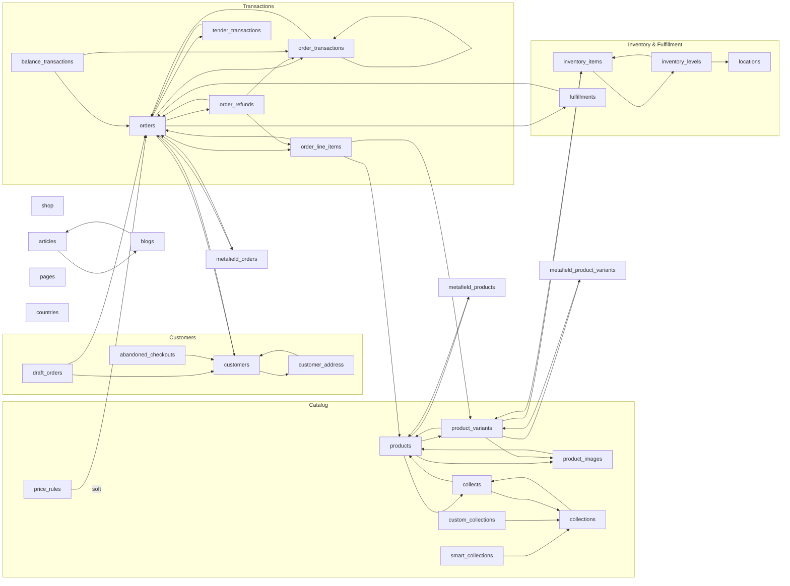

# 10_entity_relationships

## Shopify Entity-Relationship Layer (the analytics-engineering model)

This is the infrastructure that lets the agent answer an operator's question by crossing Shopify objects, not just reading one. It sits over the raw pipeline outputs (`queries/shopify/*_query.py`) and the way an analytics engineer models sources into joinable entities.

Three machine-readable pieces, all under `semantic/` and loaded by `agent/semantic/model.py`:

1. `semantic/shopify_entities.yaml` — every Shopify object as an entity: its grain, primary key, source pipeline, measures, and the join keys (relationships) to other objects. 30 entities, ~49 relationships.
2. `semantic/insights.yaml` — the curated-answer catalog: each operator question mapped to the entities it crosses, the join path, the formula, and the trap to avoid.
3. The Python model — validates referential integrity and computes join paths (shortest route between any two objects, with the exact keys).

## Tools (the proto-MCP surface)

- `shopify_entity_model(entity)` — what an object is and what it connects to.
- `shopify_join_path(from, to)` — how to join two objects: the hops + keys.
- `insight_catalog(topic)` — resolve an operator question to objects + formula.

Flow for an operator question: pick the insight (`insight_catalog`), get the objects it crosses and the join path, pull each object via its pipeline (`shopify_query_library` for the field selections), apply the canonical metric definition (docs 01–08), and return the curated answer. The join direction and keys come from this model so cross-object numbers actually line up.

## The graph at a glance

Orders are the hub. Catalog (products → variants → inventory) connects to transactions through the `order_line_items` fact, and to collections only through the `collects` join table (the GraphQL `Collect` type is gone, so `collects` is the sole product↔collection bridge). Payments fan out into three ledgers (`order_transactions`, `tender_transactions`, `balance_transactions`).

Regenerate the diagram from the model with `python scripts/render_er_diagram.py` — it reads the YAML, so it can't drift.

## Key join paths (resolved by the model)

| Operator question | Objects crossed |
|---|---|
| Product / collection performance | `order_line_items → products → collects → collections` |
| Sell-through & stock cover | `order_line_items → product_variants → inventory_items → inventory_levels → locations` |
| Customer LTV by product | `customers → orders → order_line_items` |
| Refund / return economics | `orders → order_refunds → order_line_items` |
| Payment mix & fees | `orders → tender_transactions`; `orders → order_transactions → balance_transactions` |
| Discount usage | `price_rules ⇢ (soft: code match) ⇢ orders → order_line_items` |

## Modeling rules baked in

- Direction: a relationship is declared on the side holding the foreign key (the “many” side). The graph is undirected for path-finding, and `join_condition` renders the keys correctly whichever way a path traverses it.
- Nested entities: `order_line_items` and `order_transactions` live as JSON columns on the order row (`source: nested_in:orders`), but they are modeled as first-class entities because product- and payment-level questions key off them.
- Soft links: `price_rules → orders` is a code/title match, not a hard FK, so it is flagged `soft` and only used when no hard path exists.
- Grain discipline: `inventory_levels` is (item × location) — the insight catalog flags “never sum across dates”. Each insight carries its own `watch_for` pointing at the relevant trap in doc 07.
