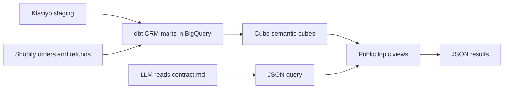

# Cube query contract for LLMs

Updated on 2026-09-24 with the Klaviyo CRM dbt and Cube bindings in PR #4.
This is a consolidated documentation snapshot, not an automatically synchronized artifact.
It describes the implemented query surface, not live data availability or a deployed endpoint.

## Instructions for a querying LLM

Use only the public fields in the revenue and topic-view inventories below. Request metrics at the desired
aggregation grain from Cube; do not average daily ratios to produce monthly ratios.
If the user asks for “sales” or “revenue” without a basis, clarify GMV versus NMV.
Do not invent fields from the roadmap or treat unavailable metrics as zero.
State the date range, revenue basis, shop scope, currency (when verified), and
relevant limitations with results. An empty result is not proof of zero activity.

The caller must supply the endpoint and a verified shop scope. The current local
spike does not implement server-side tenant filtering. Hidden dimensions do not
enforce row-level isolation. Do not describe an unscoped result as one shop's data.

## Architecture: dbt, Cube and the querying model



`semantic/serving_contract.yaml` defines the bindings and aggregate formulas.
`scripts/generate_cube_model.py` generates `cube/model/cubes/` and
`cube/model/views/`. Cube translates JSON measures, dimensions and filters into
SQL against dbt marts. dbt owns event normalization, identity, delivery matching
and attribution; Cube sums components and computes ratios at the requested grain.
Each topic has its own source and grain; there are no cross-topic joins.
The base Cube layer came from PR #3; PR #4 adds the four CRM topics below.
These are generated semantic definitions, not evidence of a deployed service.
The Option B revenue resolver does not expose these subject views; use Cube.

## CRM live validation status (2026-09-24)

The 12 CRM dbt views were created in `commerce-agents-dev.analytics`; all 26
CRM data tests passed in BigQuery. The four semantic aggregate expressions also
executed successfully. This does not validate the Cube HTTP runtime.
Klaviyo–Shopify matching uses unambiguous normalized email identity without a
shop-key equality condition. Attribution keeps the Shopify shop key; customer
engagement keeps the CRM shop key. Purchases across Shopify shops aggregate by
email before joining CRM to avoid fanout. CRM populations from different accounts
may overlap; do not treat summed account identities as unique humans.
Loaded Klaviyo coverage is only September 8–10, 2026.
See [execution evidence](../docs/KLAVIYO_CRM_BIGQUERY_VALIDATION.md).

## Klaviyo CRM public fields

All CRM dates are UTC. All listed base measures use SUM. Rates are fractions,
not percentages multiplied by 100. Do not average rates.

### `crm_campaigns`

Source: `analytics.metric_crm_campaign_performance`. Email performance by delivery date. Last preceding delivery links opens/clicks; counts are messages, not unique people.

| Public dimension | Type |
| --- | --- |
| `crm_campaigns.delivery_date` | time |
| `crm_campaigns.campaign_id` | string |
| `crm_campaigns.flow_id` | string |
| `crm_campaigns.message_id` | string |
| `crm_campaigns.message_category` | string |

| Public measure | Definition |
| --- | --- |
| `crm_campaigns.delivered_messages` | SUM(delivered_messages) |
| `crm_campaigns.linkable_messages` | SUM(linkable_messages) |
| `crm_campaigns.unlinked_messages` | SUM(unlinked_messages) |
| `crm_campaigns.opened_messages` | SUM(opened_messages) |
| `crm_campaigns.clicked_messages` | SUM(clicked_messages) |
| `crm_campaigns.open_events` | SUM(open_events) |
| `crm_campaigns.click_events` | SUM(click_events) |
| `crm_campaigns.open_rate` | Ratio of aggregate delivery counts; NULL if any delivery cannot link interactions or denominator is zero. |
| `crm_campaigns.click_through_rate` | Ratio of aggregate delivery counts; NULL if any delivery cannot link interactions or denominator is zero. |
| `crm_campaigns.click_to_open_rate` | Ratio of aggregate delivery counts; NULL if any delivery cannot link interactions or denominator is zero. |

### `crm_activity`

Source: `analytics.metric_crm_activity_daily`. Event activity and data quality by event date; includes unknown and unresolved events.

| Public dimension | Type |
| --- | --- |
| `crm_activity.event_date` | time |
| `crm_activity.event_channel` | string |
| `crm_activity.event_type` | string |
| `crm_activity.campaign_id` | string |
| `crm_activity.flow_id` | string |
| `crm_activity.message_id` | string |
| `crm_activity.message_category` | string |

| Public measure | Definition |
| --- | --- |
| `crm_activity.event_count` | SUM(event_count) |
| `crm_activity.unresolved_identity_events` | SUM(unresolved_identity_events) |
| `crm_activity.unknown_type_events` | SUM(unknown_type_events) |
| `crm_activity.missing_provider_id_events` | SUM(missing_provider_id_events) |
| `crm_activity.campaign_mapping_conflicts` | SUM(campaign_mapping_conflicts) |

### `crm_attribution`

Source: `analytics.metric_crm_attribution_daily`. Alternative six-hour attribution models; always select exactly one model and currency for values.

| Public dimension | Type |
| --- | --- |
| `crm_attribution.order_date` | time |
| `crm_attribution.attribution_model` | string |
| `crm_attribution.currency_code` | string |
| `crm_attribution.campaign_id` | string |
| `crm_attribution.flow_id` | string |
| `crm_attribution.message_id` | string |
| `crm_attribution.attribution_status` | string |

| Public measure | Definition |
| --- | --- |
| `crm_attribution.orders` | SUM(orders) |
| `crm_attribution.attributed_orders` | SUM(attributed_orders) |
| `crm_attribution.missing_value_orders` | SUM(missing_value_orders) |
| `crm_attribution.attributed_value` | Post-discount Shopify order value assigned to a touch; NULL if any attributed order has incomplete value. Select one attribution model and one currency. |

### `customer_engagement`

Source: `analytics.metric_crm_customer_engagement`. Current snapshot of observed CRM identities, not all customers or consent state. Rolling click windows are relative to execution time.

| Public dimension | Type |
| --- | --- |
| `customer_engagement.customer_status` | string |
| `customer_engagement.currency_code` | string |

| Public measure | Definition |
| --- | --- |
| `customer_engagement.crm_identities` | SUM(crm_identities) |
| `customer_engagement.delivered_messages` | SUM(delivered_messages) |
| `customer_engagement.open_events` | SUM(open_events) |
| `customer_engagement.click_events` | SUM(click_events) |
| `customer_engagement.click_events_30d` | SUM(click_events_30d) |
| `customer_engagement.click_events_90d` | SUM(click_events_90d) |
| `customer_engagement.identities_clicked_30d` | SUM(identities_clicked_30d) |
| `customer_engagement.orders` | SUM(orders) |

Campaign rates use opened/clicked **deliveries**, not distinct profiles:
open_rate = opened_messages / delivered_messages; click_through_rate =
clicked_messages / delivered_messages; click_to_open_rate = clicked_messages /
opened_messages. All three return NULL when any selected delivery is unlinked.
Machine opens and bot clicks are not filtered. Bounces/unsubscribes belong to
`crm_activity` on event date, not to the delivery-date denominator. Do not sum
per-cell distinct people; that measure is intentionally not exposed.

For attribution, always filter `attribution_model` to exactly one of `click_6h`
(last click 0–21,600 seconds before purchase) or `delivery_6h` (last received
email 180–21,600 seconds before purchase), inclusive. Each order appears once
per model, including unmatched orders: never add the two models. Matching uses
unambiguous normalized email identity, without requiring equal shop keys. This is our rule, not Klaviyo's
reported attribution or proof of causality. Use `attribution_status` to distinguish
`attributed`, `missing_order_email`, and `no_eligible_touch`. Monetary sums require
one known currency; no FX conversion. `missing_value_orders` guards the whole
requested aggregate so incomplete values cannot silently become partial totals.

Customer engagement is a **current snapshot**, with statuses `Customer`,
`Prospect`, `Unresolved`. Identities are conservative email/profile/event keys,
not a guaranteed unique-human count. Rolling 30/90-day windows are relative to
execution time; there is no historical snapshot date. Monetary customer values
are not exposed here; use the existing LTV topic for its documented population.
This view does not describe consent, list membership or all Klaviyo profiles.

Example: campaign performance by delivery day.

```json
{"measures":["crm_campaigns.delivered_messages","crm_campaigns.open_rate","crm_campaigns.click_through_rate","crm_campaigns.unlinked_messages"],"dimensions":["crm_campaigns.campaign_id"],"timeDimensions":[{"dimension":"crm_campaigns.delivery_date","dateRange":["2026-09-01","2026-09-07"],"granularity":"day"}]}
```

Example: attributed order value under one rule and currency (replace USD with
verified shop currency; shop isolation must be supplied by the deployment).

```json
{"measures":["crm_attribution.attributed_orders","crm_attribution.attributed_value","crm_attribution.missing_value_orders"],"dimensions":["crm_attribution.campaign_id"],"filters":[{"member":"crm_attribution.attribution_model","operator":"equals","values":["click_6h"]},{"member":"crm_attribution.currency_code","operator":"equals","values":["USD"]}],"timeDimensions":[{"dimension":"crm_attribution.order_date","dateRange":["2026-09-01","2026-09-07"]}]}
```

## Available surface

Public view: `revenue`. Backing cube: `commercial_revenue`.
Physical source: `analytics.metric_revenue_daily` in the configured BigQuery project.
Physical grain: one row per shop and metric date; `sales_channel` is currently
the constant `all`. The additional topic views below are also generated into the runtime model; live validation is pending.

| Public field | Type | Meaning and supported use |
| --- | --- | --- |
| `revenue.metric_date` | Time | Date used to group and filter revenue. Use day, week, month, quarter, or year granularity; omit granularity for a period total. Sales use order `processed_at`; returns use refund recognition time. These are different event clocks. |
| `revenue.sales_channel` | String | Currently always `all`. It cannot provide web/POS/retail splits. Filtering for an actual channel such as `web` will not produce that channel's sales. |

The mart uses BigQuery `DATE(timestamp)` without an explicit timezone, i.e. UTC
for timestamp inputs. Query examples use UTC. This is a calendar-date mart, not
a fiscal 4-4-5 calendar or a shop-local business-day model.

## Metrics

All six base measures below use `SUM` across the selected rows. Monetary values
are based on shop-money amounts; the view does not expose a currency field or
perform FX conversion. Do not label them USD without verifying the shop currency,
or combine shops with different currencies into a monetary total.

| Public metric | Meaning / current implementation | Unit | Source or aggregate formula | Contract status |
| --- | --- | --- | --- | --- |
| `revenue.gmv` | Post-discount, pre-return merchandise value for non-cancelled orders with processed dates and joined lines. | Shop currency | `SUM(gmv_amount)` | `target_validated` |
| `revenue.nmv` | Net merchandise value. Currently GMV plus stored-negative RMV; EMV is unavailable and contributes zero to this identity. | Shop currency | `SUM(nmv_amount)` | `target_validated` |
| `revenue.rmv` | Merchandise returns reconstructed from refund/return lines, recognized on refund date. Stored negative; excludes refunds of cancelled orders. This is not cash refunded or a cohort return rate. | Shop currency, negative | `SUM(rmv_amount)` | `target_validated` |
| `revenue.order_count` | Distinct non-cancelled order IDs per shop/day with processed dates and joined order lines, summed over the requested period. No additional paid or fulfilled status filter is applied in the mart. | Orders | `SUM(orders)` | `target_validated` |
| `revenue.gross_units` | Line quantities for the same non-cancelled sales scope as GMV. | Units | `SUM(gross_units)` | `target_validated` |
| `revenue.net_units` | Gross units plus stored-negative returned units; exchange units remain unavailable. | Units | `SUM(net_units)` | `target_validated` in YAML; sign fix locally tested, warehouse rebuild pending |
| `revenue.aov` | GMV per order, not NMV per order. | Shop currency / order | `gmv / NULLIF(order_count, 0)` | `sql_template` |
| `revenue.upt` | Gross merchandise units per order. | Units / order | `gross_units / NULLIF(order_count, 0)` | `sql_template` |
| `revenue.app` | GMV per gross merchandise unit. | Shop currency / unit | `gmv / NULLIF(gross_units, 0)` | `sql_template` |

Ratio formulas refer to aggregated measures for the complete requested group.
Zero denominators return NULL, not zero. `target_validated` records the serving
contract's prior validation status; it is not evidence of fresh or complete data
for a new requested period. `sql_template` means the derived expression is exposed,
not that its live output was independently validated in this documentation pass.

### Material interpretation caveats

- **NMV:** disclose that exchange value is unavailable. Do not claim complete exchange accounting.
- **RMV:** the contract records that previously reconciled matches were all
  `refund_no_return`. Returns without refund recognition timestamps do not enter
  this mart. A month's RMV can relate to orders from earlier months.
- **Net units:** `fct_returns` normalizes returned quantities with `-ABS(quantity)`.
  The daily mart adds those signed quantities to gross units: 10 sold and 2
  returned units produce `10 + (-2) = 8`. Do not subtract the negative quantity
  again. Exchanges remain unavailable. This local correction requires a dbt
  rebuild before it is reflected in warehouse/Cube results.
- **GMV definition discrepancy:** the catalog says “excluding exchange legs,”
  but the inspected mart and order-line intermediate do not implement an explicit
  exchange-leg exclusion. Do not promise that exclusion from this contract alone.
- **Freshness:** `computed_at` exists in the mart and drives the rollup refresh
  key, but is not exposed in the public view. Obtain freshness and extraction
  coverage from the pipeline; do not infer them from the maximum sale date.

## Unavailable fields and scope

| Name / concept | Why it cannot be requested from this view |
| --- | --- |
| `emv` | Blocked: invalid exchange-line contract; mart column is NULL by design. |
| `traffic` | Blocked: mart column is NULL; contract records no configured GA4 export for this shop. |
| `returned_units` | Physical mart column, but not a published contract metric or view member. |
| `shop_key` | Hidden cube dimension; not a caller-selected field in `revenue`. Server-side scoping remains to be implemented. |
| `extraction_id` | Declared as a hidden cube dimension/default in the YAML, but absent from the current revenue mart's output. Do not filter on it or claim extraction isolation. |
| `computed_at` | Not included in the public view. |
| Countries, currency, inventory, marketing spend, OTIF, retail productivity, maturity-adjusted LTV | Not exposed. Customer, observed LTV and product fields are available in the separate topic views below. |

The semantic aliases `merchandise_revenue` → `gmv` and
`net_merchandise_value` → `nmv` can help interpret a user's question, but are not
Cube field names. Send `revenue.gmv` or `revenue.nmv` in actual requests.

## Cube REST query examples

Use `GET /cubejs-api/v1/load` with a URL-encoded `query` JSON parameter.
Authentication and host are deployment configuration, not supplied by this file.
The ranges below are examples, not assertions that those dates have loaded data.

### Monthly GMV, NMV and AOV

```json
{
  "measures": ["revenue.gmv", "revenue.nmv", "revenue.aov"],
  "timeDimensions": [{
    "dimension": "revenue.metric_date",
    "granularity": "month",
    "dateRange": ["2025-01-01", "2025-12-31"]
  }],
  "timezone": "UTC"
}
```

### Period totals and sales productivity

```json
{
  "measures": [
    "revenue.gmv", "revenue.rmv", "revenue.nmv", "revenue.order_count",
    "revenue.gross_units", "revenue.aov", "revenue.upt", "revenue.app"
  ],
  "timeDimensions": [{
    "dimension": "revenue.metric_date",
    "dateRange": ["2025-09-01", "2025-09-30"]
  }],
  "timezone": "UTC"
}
```

For a valid monetary result, report for example: “NMV for [verified shop] over
[dates] was [value] in [verified currency], recognized on sales/refund dates.
Exchange value is unavailable.” If scope or currency is unknown, state that
before interpreting the result. For net units, confirm the corrected dbt models have been rebuilt before
quoting warehouse results.

## Topic views

These bindings are SQL templates over existing dbt models, not claims of live
warehouse validation. Each topic has its own grain and scope. Query one topic at
a time; no joins between topics are declared. Customer models currently lack a
shop key and require an isolated single-shop dataset. Hidden shop keys in other
models are not row-level security. All monetary values use shop currency without FX.

The topic bindings live in `subject_views` in `serving_contract.yaml`. They are
compiled by the Cube generator; the legacy Option B `ServingContract.resolve()`
API still resolves only the original `metrics` section.

### `customers` — enabled

Current customer snapshot, single-shop source. Time filters select customers by first/last purchase; measures remain lifetime totals, not period activity. Identity-resolved purchasers only. RFM uses current date and available purchase history.

Source: `analytics.dim_customer_rfm`.

| Field | Type / aggregation | Meaning |
| --- | --- | --- |
| `customers.rfm_group` | string dimension | Source column `rfm_group`. |
| `customers.rfm_combo` | string dimension | Source column `rfm_combo`. |
| `customers.r_score` | number dimension | Source column `r_score`. |
| `customers.f_score` | number dimension | Source column `f_score`. |
| `customers.m_score` | number dimension | Source column `m_score`. |
| `customers.first_purchase_ts` | time dimension | Source column `first_purchase_ts`. |
| `customers.last_purchase_ts` | time dimension | Source column `last_purchase_ts`. |
| `customers.customer_count` | count_distinct | Distinct resolved purchasing identities. |
| `customers.orders` | sum | Lifetime non-cancelled orders for the selected customers. |
| `customers.gross_spend` | sum | Lifetime post-discount spend, before refunds, shop currency. |
| `customers.net_contribution` | sum | Lifetime gross spend plus negative recognized refunds; no exchange valuation. |
| `customers.average_recency_days` | avg | Average days since last purchase at query time. |
| `customers.orders_per_customer` | orders / NULLIF(customer_count, 0) | Lifetime orders per selected customer. |
| `customers.aov` | gross_spend / NULLIF(orders, 0) | Ratio of lifetime spend to orders, not average of customer AOVs. |

### `customer_ltv` — enabled

Observed historical customer value, single-shop source. Not predicted LTV, margin, or maturity-adjusted 90/365-day LTV. First-purchase filters select cohorts; values span all available history.

Source: `analytics.dim_customer_rfm`.

| Field | Type / aggregation | Meaning |
| --- | --- | --- |
| `customer_ltv.first_purchase_ts` | time dimension | Source column `first_purchase_ts`. |
| `customer_ltv.rfm_group` | string dimension | Source column `rfm_group`. |
| `customer_ltv.customers` | count_distinct | Distinct resolved purchasing identities. |
| `customer_ltv.gross_spend` | sum | Accumulated spend before refunds, shop currency. |
| `customer_ltv.recognized_rmv` | sum | Accumulated recognized merchandise refunds, stored negative. |
| `customer_ltv.net_contribution` | sum | Accumulated spend plus stored-negative recognized refunds. |
| `customer_ltv.observed_ltv` | net_contribution / NULLIF(customers, 0) | Observed net value per customer across available history. No age normalization. |
| `customer_ltv.gross_value_per_customer` | gross_spend / NULLIF(customers, 0) | Observed gross spend per customer across available history. |

### `customer_cohorts` — enabled

Single-shop acquisition/activity monthly cells. Only active cells exist; missing cells are not supplied as zero. No maturity-adjusted retention denominator. Spend excludes cancellations but does not net refunds.

Source: `analytics.fct_customer_cohorts`.

| Field | Type / aggregation | Meaning |
| --- | --- | --- |
| `customer_cohorts.cohort_month` | time dimension | Source column `cohort_month`. |
| `customer_cohorts.activity_month` | time dimension | Source column `activity_month`. |
| `customer_cohorts.months_since_first_purchase` | number dimension | Source column `months_since_first_purchase`. |
| `customer_cohorts.active_customer_months` | sum | Distinct customers within each acquisition/activity cell; summed across months this is customer-months, NOT unique customers. |
| `customer_cohorts.orders` | sum | Orders in the selected activity cells. |
| `customer_cohorts.spend` | sum | Post-discount spend before refunds, shop currency. |
| `customer_cohorts.aov` | spend / NULLIF(orders, 0) | Aggregate spend per order for selected activity cells. |

### `returns` — enabled

Refund/return reconciliation at original order-line grain. Refund values take precedence. Includes cancellations; not the same exclusion scope as revenue RMV. Recognition is latest refund timestamp per line, not individual refund event history. Pending return-only rows have null recognition dates.

Source: `analytics.fct_returns`.

| Field | Type / aggregation | Meaning |
| --- | --- | --- |
| `returns.match_status` | string dimension | Source column `match_status`. |
| `returns.rmv_recognition_ts_utc` | time dimension | Source column `rmv_recognition_ts_utc`. |
| `returns.line_count` | count_distinct | Distinct original order lines in the selected shop. |
| `returns.rmv` | sum | Stored-negative merchandise value; cancellations are not excluded in this fact. |
| `returns.return_units` | sum | Stored-negative quantities. Includes pending returns unless recognition date is filtered. |
| `returns.refund_tax` | sum | Stored-negative tax amounts. |
| `returns.allocated_adjustments` | sum | Order adjustments allocated across lines; may be attributed across recognition dates. |

### `merchandise` — enabled

Product sales line analysis. Cancelled orders and gift cards are included unless explicitly filtered out; apply both false filters for non-cancelled merchandise. Post-discount values; refunds are not netted.

Source: `analytics.fct_order_sale_line`.

| Field | Type / aggregation | Meaning |
| --- | --- | --- |
| `merchandise.metric_date` | time dimension | Source column `metric_date`. |
| `merchandise.sku` | string dimension | Source column `sku`. |
| `merchandise.title` | string dimension | Source column `title`. |
| `merchandise.product_gid` | string dimension | Source column `product_gid`. |
| `merchandise.variant_gid` | string dimension | Source column `variant_gid`. |
| `merchandise.is_cancelled_order` | boolean dimension | Source column `is_cancelled_order`. |
| `merchandise.is_gift_card` | boolean dimension | Source column `is_gift_card`. |
| `merchandise.orders` | count_distinct | Distinct orders in the selected group; do not sum across products. |
| `merchandise.units` | sum | Sold line quantities before returns. |
| `merchandise.original_value` | sum | Pre-discount line amount in shop currency. |
| `merchandise.discounted_value` | sum | Post-discount line amount in shop currency. |
| `merchandise.value_per_unit` | discounted_value / NULLIF(units, 0) | Post-discount value per unit. |

### `digital_funnel` — disabled / opt-in

Opt-in GA4 custom 30-minute sessions. Enable only after GA4 is configured and the mart built. Date is property-local; no Shopify revenue linkage. Counts of sessions reaching purchase, not transaction counts.

Source: `analytics.metric_ga4__funnel_daily`.

| Field | Type / aggregation | Meaning |
| --- | --- | --- |
| `digital_funnel.metric_date` | time dimension | Source column `metric_date`. |
| `digital_funnel.channel_group` | string dimension | Source column `channel_group`. |
| `digital_funnel.property_id` | string dimension | Source column `property_id`. |
| `digital_funnel.stream_id` | string dimension | Source column `stream_id`. |
| `digital_funnel.sessions` | sum | Custom 30-minute sessions. |
| `digital_funnel.purchase_sessions` | sum | Sessions with a purchase event. |
| `digital_funnel.purchase_session_rate` | purchase_sessions / NULLIF(sessions, 0) | Share of sessions reaching purchase; not orders/session CVR. |

### Customer and product query examples

Observed LTV by acquisition month (available-history values, not 365-day LTV):

```json
{"measures":["customer_ltv.customers","customer_ltv.observed_ltv"],"timeDimensions":[{"dimension":"customer_ltv.first_purchase_ts","granularity":"month"}],"timezone":"UTC"}
```

Current RFM distribution:

```json
{"measures":["customers.customer_count","customers.net_contribution"],"dimensions":["customers.rfm_group"]}
```

Acquisition/activity cells (customer-month counts are unique only within a cell):

```json
{"measures":["customer_cohorts.active_customer_months","customer_cohorts.orders","customer_cohorts.spend"],"timeDimensions":[{"dimension":"customer_cohorts.cohort_month","granularity":"month"},{"dimension":"customer_cohorts.activity_month","granularity":"month"}]}
```

Merchandise sales by SKU, explicitly excluding cancellations and gift cards:

```json
{"measures":["merchandise.discounted_value","merchandise.units"],"dimensions":["merchandise.sku"],"filters":[{"member":"merchandise.is_cancelled_order","operator":"equals","values":["false"]},{"member":"merchandise.is_gift_card","operator":"equals","values":["false"]}],"timeDimensions":[{"dimension":"merchandise.metric_date","dateRange":["2025-01-01","2025-12-31"]}]}
```

Digital is deliberately not emitted into runtime while `enabled: false`. After
configuring GA4 and building its mart, enable it and regenerate. The other roadmap
topics (paid marketing, retail productivity, inventory and OTIF) still require
source marts. No forecast LTV, 90/365-day mature LTV, CAC or retention rate is implied
by the customer views above.

## Sources and maintenance

This document consolidates the following repository sources:

1. `semantic/serving_contract.yaml`: routing, status, aliases, aggregation,
   numerator/denominator and honesty flags. This remains the executable serving contract.
2. `cube/model/views/*.yml`: exact public field allowlists, including CRM.
3. `cube/model/cubes/*.yml`: generated types, SQL expressions,
   visibility and rollup configuration.
4. `semantic/metrics.yaml`: business vocabulary only. Its historical
   `implemented` flags are not the current serving allowlist.
5. `dbt/models/marts/metric_revenue_daily.sql`,
   `dbt/models/marts/fct_returns.sql`,
   `dbt/models/intermediate/int_shopify__orders.sql` and
   `dbt/models/intermediate/int_shopify__order_line_items.sql`: actual calculation,
   event clocks, scope and sign behavior.
6. `cube/README.md`: runtime/deployment limitations.
7. `dbt/models/marts/crm/`, `dbt/models/intermediate/crm/` and
   `docs/KLAVIYO_CRM_DBT.md`: implemented CRM grains, matching and attribution rules.

Where intended definitions and SQL disagree, the discrepancy is explicitly
recorded above; do not assume the intended formula is what the service executes.
`knowledge/semantic-layer-reference/` is design/reference material and is not
used to expand this query allowlist.

Update this document whenever these sources change. The existing
`scripts/generate_cube_model.py --check` checks Cube YAML only; it does not
regenerate or validate this Markdown document. Automated document generation
requires moving the SQL-specific caveats and field metadata into structured
contract metadata first.
